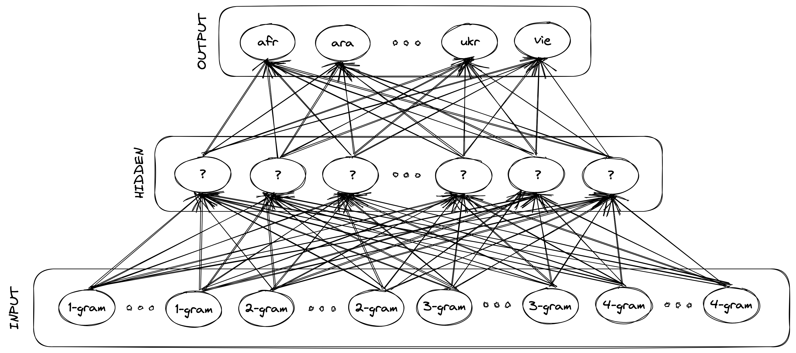

# Lande

A tiny neural network for natural language detection.

This model is trained with data from the [Tatoeba](https://tatoeba.org/) project, so it works well on short inputs too.

## Model



Architecture:

- A very simple fully connected neural network with 1 hidden layer is trained, with character ngrams as input, and supported languages as output.

Details:

1. Character ngrams, at length 1, 2, 3, and 4, are extracted from the input string, with the assumption that with this data it should be possible to tell apart natural languages fairly reliably, if the input string is long enough.
2. Only a fixed number of the most frequent ngrams of supported languages are considered, which are extracted and stored during training, as they carry the most amount of signal overall, and the rest are simply discarded.
3. Compared to `CLD3` ngrams are not hashed, as I think that kinda unpredictably confuses the model, as now different ngrams can have the same hash, so unimportant ngrams could be confused for important ones. Also that requires allocating a somewhat large key space for the hashes, while instead we want to be parsimonious with that, if we only need to remember 100 1-grams that's what we should be allocating memory for, but a small key space would get quickly crowded with colliding hashes, making it somewhat useless.
4. Compared to `CLD3` no embedding layers are used here, as I think they are not needed with this approach because the model is being given clearer signals, since each input always corresponds to a specific ngram.
5. The value of each input neuron is the normalized frequency of the ngram corresponding to that neuron in the input string. Basically we tell the network if each supported ngram is present and how frequent it is.
6. To make a prediction the frequency of each supported input ngram is calculated, and a forward pass is performed.

## Languages

The following 50 languages are supported.

If you want to experiment you can tweak some internal constants and add more languages, remove languages (which necessarily improves accuracy for the remaining ones), tweak hyper-parameters for the neural network etc.

| ISO 639-3 | Name        |
| --------- | ----------- |
| `afr`     | Afrikaans   |
| `ara`     | Arabic      |
| `aze`     | Azerbaijani |
| `bel`     | Belarusian  |
| `ben`     | Bengali     |
| `bul`     | Bulgarian   |
| `cat`     | Catalan     |
| `ces`     | Czech       |
| `ckb`     | Kurdish     |
| `cmn`     | Mandarin    |
| `dan`     | Danish      |
| `deu`     | German      |
| `ell`     | Greek       |
| `eng`     | English     |
| `est`     | Estonian    |
| `eus`     | Basque      |
| `fin`     | Finnish     |
| `fra`     | French      |
| `hau`     | Hausa       |
| `heb`     | Hebrew      |
| `hin`     | Hindi       |
| `hrv`     | Croatian    |
| `hun`     | Hungarian   |
| `hye`     | Armenian    |
| `ind`     | Indonesian  |
| `isl`     | Icelandic   |
| `ita`     | Italian     |
| `jpn`     | Japanese    |
| `kat`     | Georgian    |
| `kaz`     | Kazakh      |
| `kor`     | Korean      |
| `lit`     | Lithuanian  |
| `mar`     | Marathi     |
| `mkd`     | Macedonian  |
| `nld`     | Dutch       |
| `nob`     | Norwegian   |
| `pes`     | Persian     |
| `pol`     | Polish      |
| `por`     | Portuguese  |
| `ron`     | Romanian    |
| `run`     | Rundi       |
| `rus`     | Russian     |
| `slk`     | Slovak      |
| `spa`     | Spanish     |
| `srp`     | Serbian     |
| `swe`     | Swedish     |
| `tgl`     | Tagalog     |
| `tur`     | Turkish     |
| `ukr`     | Ukrainian   |
| `vie`     | Vietnamese  |

## Install

```sh
npm install --save lande
```

## Usage

The library exports a single function which gives you a sorted list of detected languages and their probabilities.

```ts
import lande from 'lande';

lande ( 'What language is this sentence written in?' ); // => [['eng', 0.9999921321868896], ['deu', 0.000002357382982154377], ['heb', 0.000001461773877053929], ...]
lande ( 'In che lingua è scritta questa frase?' ); // => [['ita', 0.9999935626983643], ['ell', 0.0000025603442281862954], ['vie', 0.000002114558583343751], ...]
```

## License

MIT © Fabio Spampinato
